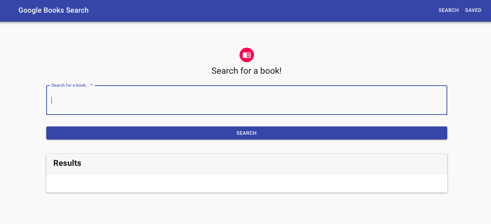
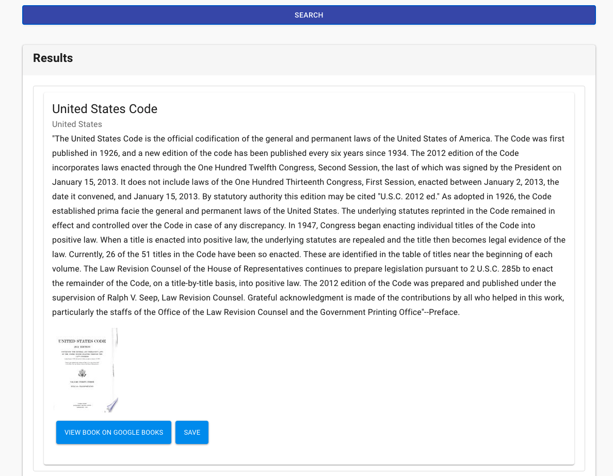
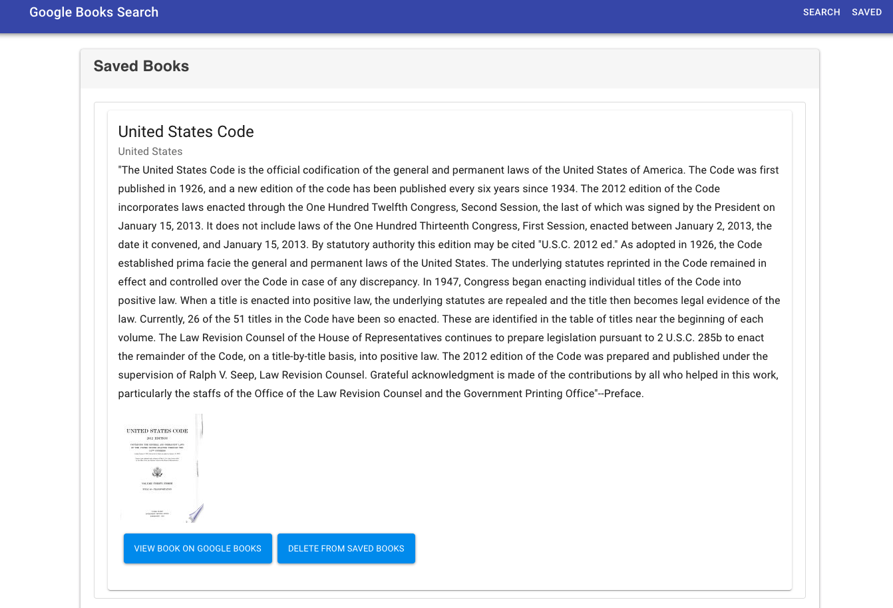

# Google Books Search
  

  ## Description

  This is a React-based full-stack application that allows users to search for books. Users will be able to save books that can be purchased or reviewed at a later date.

  ## Table of Contents

  * [Installation](#installation)

  * [Usage](#usage)
  
  * [License](#license)

  * [Badges](#badges)

  * [Credits](#credits)

  * [Questions](#questions)

  ## Installation

  For this project to run properly locally, install the necessary dependencies by using the following terminal command: npm i

  ## Usage

  The application can be used via the browser at the below deployed link: 

  [Heroku Deployment](https://greve-vin-26163.herokuapp.com/)

  The application's GitHub repository can be found below:

  [GitHub Repository](https://github.com/cikennedy/Google-Books-Search)

  

  

  

  ## License

  This project is licensed using the MIT license.

  ## Badges

  

  ## Credits

  Many of the components and pages were used from templates and source code from the React Framework[Material-UI](https://material-ui.com/). 

  ## Questions

  If you have any questions or feedback about the project, please contact me by email at [kennedy.christopherian@gmail.com](mailto:kennedy.christopherian@gmail.com). 

  Other projects and work are featured at [cikennedy](https://github.com/cikennedy).

